# Frequency Estimation

Sinyal işlemenin temel tekniği olarak frekans tahmini, neredeyse tüm mühendislik teknolojisi alanlarına uygulanır. Sinyalin farklı frekans bileşenlerine göre, tek frekansı ve yoğun frekansı içeren frekans tahmin yöntemleri sıralanır. Tek frekanslı sinyalin frekans tahmin yöntemleri, ağırlık merkezi yöntemi, faz farkı yöntemi, genlik oranı yöntemi. Yoğun frekans sinyalinin frekans tahmin yöntemleri; chirp Z dönüşümü (CZT) yöntemi, yakınlaştırma-FFT yöntemi, iterasyon, full-phase yöntemi gibi sinyal işleme yöntemleri listelenir. 

 
 

**Zaman Domaininde Sinüsoidal Frekans tahmini**
  
  Gürültüsüz gerçek veya karmaşık bir sinüzoidin frekansını tahmin etme konusu,FFT'lerin gerçekleştirilmesini gerektirmeyen tahmin algoritmaları mevcuttur. zaman Domaininde sinüsoidal sinyal üzerinden periyodik olarak seçilen örnek ile gerçekleştirilebilir. 

 
Gerçek zamanlı bir sinüsoidal giriş dizisini şu şekilde temsil edildiğini varsayabiliriz.
 
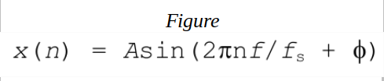
n→ time-domain index integer. 
Fs → örnekleme frekansı 
F → sinusoidal sinyalin frekansı.
 
 

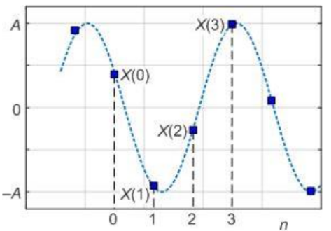   
       
       

> Zaman-domaininde 3 örnek ile frekans tahmini  

Clay Turner, gerçek değerli bir sünusoidal sinyalin tahmininde periyodik olarak seçilen 3 örnek ile;

Tek tip örnekleme olduğunu varsayarsak ve ardışık olarak seçtiğimiz 3 örnek ile y0, y1, y2 
 
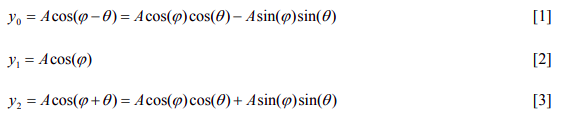   
      
     y0 ile y2 toplayalım.

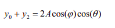  
     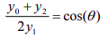   

     0 = 2*pi*f/fs

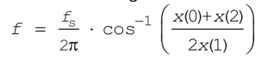   
      

Octave programında 3 örnek yöntemi kullanılarak frekans tahmini 500-4000Hz arasında değişen 16000 örnekleme frekansı ile hazırlanmış bir sinusoidal sinyalin frekans tahmin grafiği aşağıdaki gibidir. 

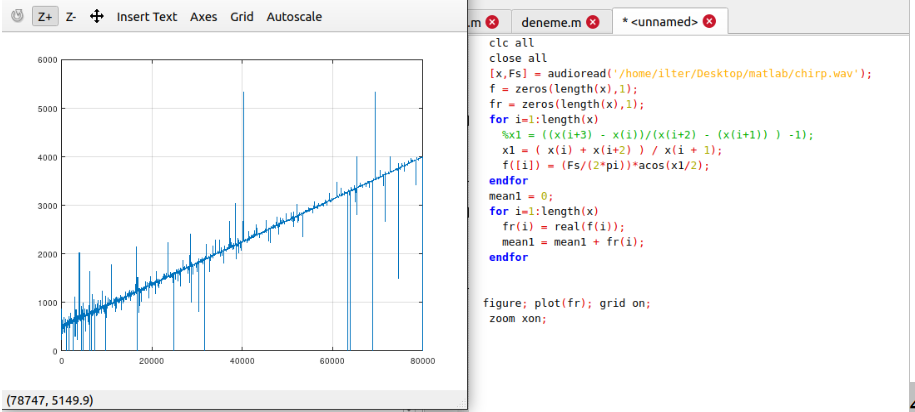   

 

> Zaman-domaininde 4 örnek ile frekans tahmini  
> 
Clay Turner, gerçek değerli bir sünusoidal sinyalin tahmininde periyodik olarak seçilen 4 örnek ile;

Tek tip örnekleme olduğunu varsayarsak ve ardışık olarak seçtiğimiz 4 örnek ile y0, y1, y2, y3
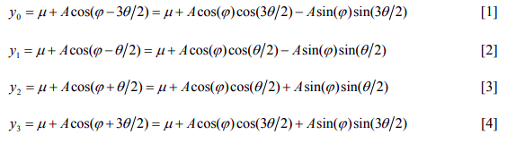   
   

(y3 - y0) ve (y2 - y1) karşılıklı olarak örnekleri birbirinden çıkarttıktan sonra (y3 - y0)/(y2 - y1) ile; 
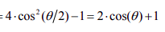   
    
    0 = 2*pi*f/fs

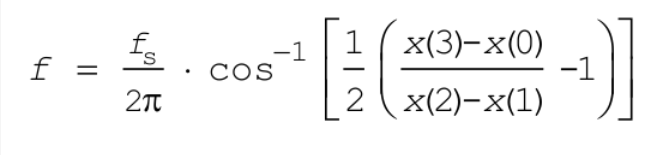   
 

4 örnek ile frekans tahmini yönteminde 500-4000Hz aralığında değişen 16000 örnekleme frekanslı sinyalin belli bir frame aralığında frekans tahmini uygulanmasının sonucu: 
 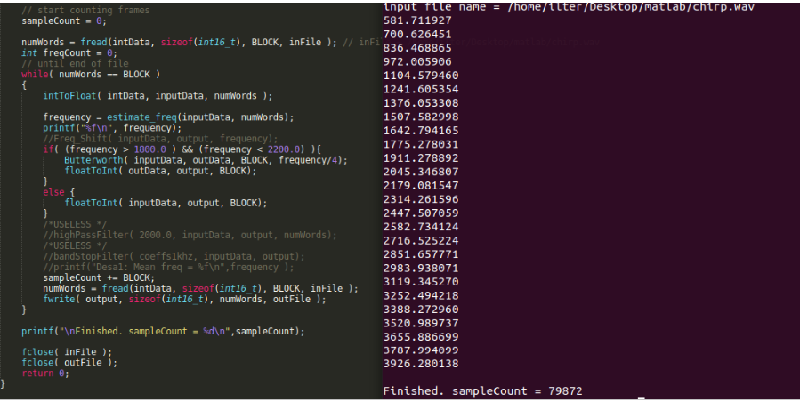   
